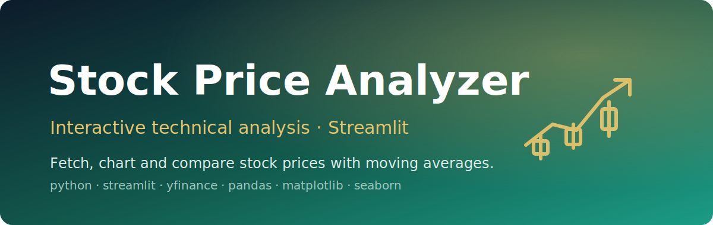

<p align="center">
  
</p>

<h1 align="center">Stock Price Analyzer</h1>

<p align="center"><em>An interactive Streamlit app to fetch, chart, and compare historical stock prices with moving averages.</em></p>

<p align="center">
  
  
  
  
  
</p>

**Stock Price Analyzer** is a single-file **Streamlit** web app for basic technical analysis of equities. It pulls historical price data straight from Yahoo Finance via **`yfinance`**, computes indicators with **`pandas`**, and renders the charts with **`matplotlib`** and **`seaborn`** — all driven from an interactive sidebar with no code changes required.

> Type a ticker, pick a date range, and read the trend — technical analysis without leaving the browser.

---

## ✨ Features

- **Interactive UI** — every parameter lives in a Streamlit sidebar; the main view updates live.
- **One or two tickers** — analyze a single stock or compare two side by side (e.g. `AAPL, MSFT`).
- **Custom date range** — pick start and end dates (defaults to the last two years).
- **Configurable moving averages** — short and long Simple Moving Average (SMA) windows you set yourself.
- **Price + SMA chart** — closing price (`Adj Close`, falling back to `Close`) overlaid with both SMAs.
- **Optional daily simple returns** — `pct_change` plotted as a toggleable subplot.
- **Optional exploratory trend** — last 7 trading days of the short-minus-long SMA difference as green/red bars.
- **Caching** — `@st.cache_data` avoids re-downloading and re-computing on every interaction.

## 🏗️ Pipeline

```
 Sidebar inputs (tickers, dates, MA windows, toggles)
        │
        ▼
 fetch_stock_data()      ──►  yfinance.download() from Yahoo Finance  (cached 1h)
        │                     picks 'Adj Close', falls back to 'Close'
        ▼
 calculate_indicators()  ──►  short SMA, long SMA, simple returns      (cached)
        │
        ▼
 create_plots()          ──►  matplotlib/seaborn figures per ticker
        │                     price+SMA · returns · trend bars
        ▼
 Streamlit main area     ──►  charts + processed-data preview
```

## 🚀 Run it

```bash
# 1. Create and activate a virtual environment
python -m venv venv
source venv/bin/activate        # Windows: venv\Scripts\activate

# 2. Install dependencies
pip install streamlit yfinance pandas matplotlib seaborn

# 3. Launch the app
streamlit run main.py
```

The app opens in your browser. Use the sidebar to enter tickers, set the date range and SMA windows, and toggle the optional returns / trend plots.

## 🔧 Configuration

All settings are controlled live from the Streamlit sidebar — no code edits needed:

| Control | Description | Default |
| --- | --- | --- |
| Tickers | One or two comma-separated symbols (max 2) | `AAPL, MSFT` |
| Date range | Start / end dates | last 2 years → today |
| Short MA window | Days for the short SMA | `20` |
| Long MA window | Days for the long SMA | `50` |
| Daily Simple Returns | Toggle the returns subplot | off |
| Exploratory Trend | Toggle the 7-day MA-diff bars | on |

## 📊 Output

- A price chart per ticker with short and long SMAs overlaid.
- An optional daily simple-returns plot.
- An optional 7-day exploratory trend bar chart (short SMA − long SMA), colored green for positive and red for negative.
- An expandable table previewing the most recent processed data rows.

## 🗺️ Roadmap

Ideas for future iterations:

- More technical indicators (RSI, MACD, Bollinger Bands).
- Interactive charts with zoom/tooltips (e.g. Plotly).
- Basic time-series forecasting.
- Exporting plots and analysis data.
- A `requirements.txt` for reproducible installs.

## 🙏 Acknowledgements

- Data from **Yahoo Finance**, retrieved via the **`yfinance`** library.
- Built with **Streamlit**, **pandas**, **matplotlib**, and **seaborn**.
